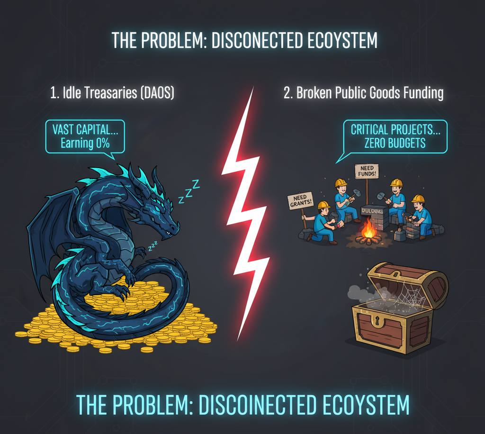
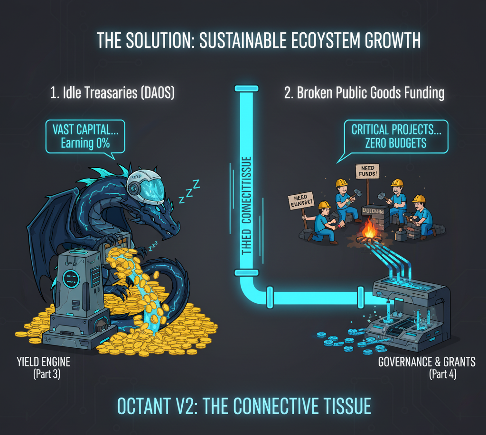
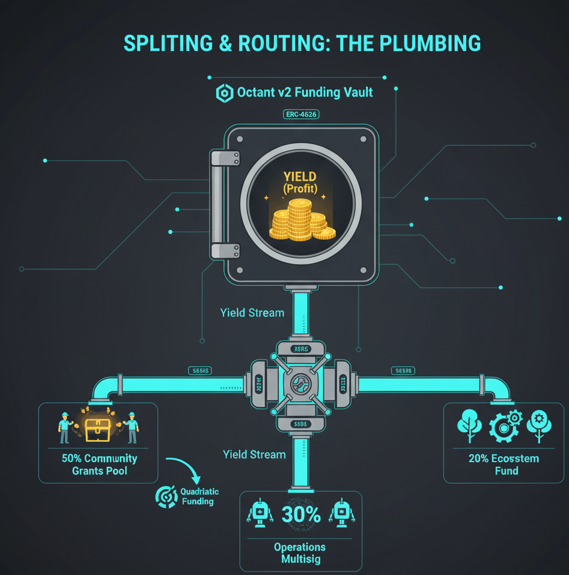

## **Part 1: The Vision & Core Concepts**

Before we write a single line of code, we *must* understand the "why" and the "what." This section covers the problem Octant V2 is designed to solve and the fundamental "Lego blocks" it gives us to build with.

### 🚀 The Vision: An "Ecosystem Growth Engine"

At its heart, Octant V2 is open-source public infrastructure designed to be a **sustainable "ecosystem growth engine."** But what does that actually mean?

#### The Problem
Right now, the on-chain world is split into two inefficient camps:

1.  **Idle Treasuries:** Think of protocols, DAOs, and foundations sitting on massive treasuries. Most of this capital is **idle** - it's not earning yield, and it's not being actively used to grow its own ecosystem.
2.  **Broken Funding:** On the other side, you have builders, researchers, and public goods projects that are *starving* for funding. They bounce from one short-term grants program to the next, hoping for a one-time check.

This system is inefficient on one side and unsustainable on the other.

#### The "Why": The Connective Tissue
Octant V2 is designed to be the **"connective tissue"** that fixes this. It's the plumbing that creates a permanent, automated link between two key areas:

* **Capital Accumulation (DeFi):** All the powerful tools we've built for generating yield (staking, lending, etc.).
* **Capital Allocation (Grants):** All the tools we've built for distributing funds (grants programs, quadratic funding, etc.).

Octant V2 bridges this gap, creating a flow where idle treasuries can *generate* yield and *automatically* route that yield to fund their ecosystems, all without touching the original principal.

#### The "Who": Dragons & The Community
To understand the Octant model, you need to know the two key players defined in the system:

* 🐉 **The "Dragons":** These are the **Capital Providers**. Think of a DAO, a foundation, or any organization with a large treasury (a "treasure hoard"). Octant V2 gives them the tools (like `"Dragon" Funding Vaults` for their Safe wallets) to mobilize that capital and build their own "ecosystem growth engine."
* 🧑‍🤝‍🧑 **The "Stakers" & "Allocators":** This is the **Community**. These are the users who hold the Dragon's native token. Octant's `Regen Staker` system (which we'll cover later) allows them to lock their tokens to gain rewards and, crucially, to *participate* in the "allocation process" - voting on where the Dragon's yield should go.

This model aligns incentives: The Dragons provide the capital, and the Community helps allocate that capital's yield in a decentralized way.

#### The Core Promise: The "Self-Repaying Donation"
If you remember only one thing from this section, make it this. The "golden rule" of Octant V2 is:

> **You keep your principal; only the yield is donated.**

Think of it as a **"self-repaying donation."** A Dragon can deposit 10,000,000 `USDC` into an Octant vault, and that 10,000,000 `USDC` is *always* theirs. But all the *interest* it generates (say, 500,000 `USDC` per year) is automatically routed to their grants program.

This is the "engine": a perpetual funding stream that never runs out.

---

### 🧱 The Fundamental Components (What You Can Build With)

Now for the "what." If the vision is the "engine," what are the actual "Lego blocks" you get to build with? It all boils down to these core components.

#### Funding Vaults (The "USB-C" of Yield)
This is the main building block. A Funding Vault is the "self-repaying donation" account we just talked about. But here's the key for us as developers:

They are **ERC-4626 compliant.**

If you're not familiar, ERC-4626 is like the **USB-C port for yield vaults.** Before it, every vault (Yearn, Aave, etc.) had its own unique "plug," making them hard to build on top of. ERC-4626 created a single, universal standard for all yield-bearing vaults.

By using this standard, Octant's Funding Vaults are "Lego blocks" that can be plugged into *any* other ERC-4626-compatible protocol, and vice-versa. This simple, powerful idea is what makes the *entire* Octant V2 architecture so composable.

#### Splitting & Routing (The "Plumbing")
If the Funding Vault is the "account," the **Splitting & Routing Contracts** are the **"automatic payment plumbing."**

This is simply a `Payment Splitter` contract that sits at the "donation address" of your vault. When the vault's yield (profit) is harvested, it's sent to this splitter. The splitter then automatically routes the funds based on rules *you* set.

**Example:**
* **50%** to the Community Grants Pool (for a Quadratic Funding round).
* **30%** to the Operations multisig (to pay for core devs).
* **20%** to an Ecosystem Fund.

#### Contribution Types
So, how do "Dragons" get their funds *into* this system? There are two main methods:

1.  **Regenerative Funding Contribution (The "All-In-One" Method):** This is the standard path. You simply **deposit your assets (like `USDC`) *directly into* an Octant Funding Vault.** The vault does all the hard work of generating and routing the yield for you. This is what the "Regen Staker" is named after.
2.  **Direct Funding Contribution (The "DIY" Method):** This is for advanced Dragons with their own Safe wallets. They **keep their assets in their own wallet** and run their *own* DeFi strategies. They then just use Octant's `Safe Linear Allowance` contract to "top up" the distribution contracts with their "DIY" profits.

#### Key Design Principles
These components all work together, guided by three core principles:

* **Capital Preservation:** This is the "golden rule" we talked about. The system is built to separate the principal from the yield, so the core treasury is never spent.
* **Credible Neutrality:** Octant V2 provides the *tools* (the "how"). It is credibly neutral and **never** tells a Dragon *what* to fund. The Dragons and their communities set their own rules.
* **Sustainability:** By using yield instead of principal, this system creates a continuous, sustainable funding stream that doesn't deplete reserves.

---

**Now you understand the "why" and the "what."** You see the problem (idle treasuries, broken funding) and the solution (a sustainable, yield-based engine built from composable "Lego blocks" like ERC-4626 vaults and payment splitters).
