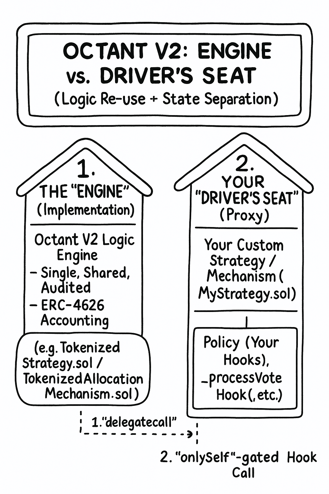

In Part 1, we covered the "why" of Octant V2. Now, we're diving into the "how."

This section is the key to the entire system. Octant V2 uses **one central design pattern** for *everything*-from its yield vaults to its governance mechanisms. If you understand this one pattern, you'll understand how to build anything on Octant.

It's a "tokenized" architecture, which I call the **"Engine vs. Driver's Seat"** pattern.

---

## **Part 2: The Core Architecture (The "How It Works")**

This pattern solves a classic developer problem: how to build a flexible, secure, and multi-faceted system without creating a single, monolithic contract that's impossible to audit and expensive to deploy.

The solution is to separate the *process* from the *policy*.

### 🚗 The "Engine vs. Driver's Seat" Pattern

#### 1. The "Engine" (The *Implementation*)
The "Engine" is the **single, shared, heavily-audited** contract that contains all the complex, high-risk "guts" of the system.

* **For Yield Vaults:** This is the `TokenizedStrategy.sol` contract.
* **For Governance:** This is the `TokenizedAllocationMechanism.sol` contract.

This "Engine" is deployed *only once* per network. It handles all the complex logic you don't want to build (or audit) yourself, like ERC-4626 accounting, state-machine lifecycles, and EIP-712 signatures.

#### 2. The "Driver's Seat" (The *Proxy*)
The "Driver's Seat" is the **minimal, lightweight contract that you, the developer, actually build and deploy.**

* **For Yield Vaults:** This is your `MyAaveStrategy.sol` (which inherits from `BaseStrategy`).
* **For Governance:** This is your `My1p1vMechanism.sol` (which inherits from `BaseAllocationMechanism`).

This contract is tiny and cheap to deploy. It holds almost no logic. It only holds two things:
1.  **Storage:** The "filing cabinet" for your specific strategy or mechanism's data.
2.  **Policy (The "Hooks"):** Your custom "rules" (e.g., `_deployFunds` or `_processVoteHook`).

---

### ✨ The "Magic": How They Connect Securely

So, how does your simple "Driver's Seat" control the powerful "Engine"?

1.  **`delegatecall`:** When a user calls your "Driver's Seat" (proxy), it forwards the call to the central "Engine" (implementation). A `delegatecall` tells the "Engine" to run its complex logic *in the context of your contract*, using **your** storage. This gives you **Logic Re-use** (from the "Engine") with **State Separation** (in your "Driver's Seat").

2.  **`onlySelf`-gated "Hooks":** When the "Engine" is running and needs your custom rule, it **"calls back"** to your "Driver's Seat" and runs your "hook" function (e.g., `_processVoteHook`). This hook is protected by an **`onlySelf`** guard, which means *only* the "Engine" (during its `delegatecall`) can run it. A normal user can't call your hooks directly.

This creates a perfect, secure separation:
* **The "Engine"** provides the *process*.
* **Your "Driver's Seat"** provides the *policy*.

---

And that's the whole pattern. You've already learned the hardest part.

In next parts, you'll just see this *exact same architecture* applied to different problems. Let's build.
